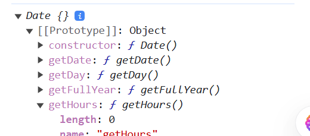

# React Basics

### How to start a React project?

```JavaScript

import React from 'react';
import ReactDOM from 'react-dom';

//ReactDOM.render( what to render, Where to render)
ReactDOM.render(<h1>Hello World</h1>, document.getElementById('root'));

```

#### React allows us to use HTML inside JavaScript using JSX syntax, and also allows us to use JavaScript inside HTML using curly braces {}.

as an example:

```JavaScript
const divOne = document.querySelector("divOne");
const name = "Majd";
const divTwo = <div>{name}</div>; // this is not allowed in vanilla js
divOne.append(div1);
```

#### Here where the power of React comes in\_, it allows us to use HTML tags inside JavaScript code using JSX syntax. and also allows us to use JavaScript expressions inside HTML using curly braces {}.

example:

```JavaScript
const name = "Majd";
const element = <h1>Hello, {name}!</h1>;
ReactDOM.render(element, document.getElementById('root'));
```

This will render "Hello, Majd!" on the webpage.

! Example:

```JavaScript
import React from "react";
import ReactDOM from "react-dom";

const name = "Majd";
const luckyNumber = Math.floor(Math.random());

const element = (
  <>
    <h1>Hello {name}</h1>
    <ul>
      <li> Your luck number is: {luckyNumber}</li>
    </ul>
  </>
);

ReactDOM.render(element, document.getElementById("root"));
```


### So, in general you can insert any JavaScript _expression_ inside curly braces {} in JSX. This includes variables, mathematical operations, function calls, and more.

example:

```JavaScript
const a = 5;
const b = 10;
const element = <h1>{a} + {b} = {a + b}</h1>;
const elementTwo = <h1>{Math.floor(Math.random()*10)}</h1>
ReactDOM.render(element, document.getElementById('root'));
```

### Why do we say expression not statement?

Because statements like if, for, while, etc. cannot be used inside JSX curly braces. Only expressions that evaluate to a value can be used.
example:

```JavaScript
import React from "react";
import ReactDOM from "react-dom";

const name = "Majd";
const luckyNumber = Math.floor(Math.random());

const element = (
  <>
    <h1>Hello {name}</h1>
    <ul>
      <li>  {
        if (luckyNumber >5) {
            return (Your luck number is: {luckyNumber})
            }else{
                return("you are not lucky")
            }

        }</li>

    </ul>
  </>
);


ReactDOM.render(element, document.getElementById("root"));
```

### you can use many curly braces in the element as you want.

example:

```JavaScript
import React from "react";
import ReactDOM from "react-dom";
const name = "Majd";
const luckyNumber = Math.floor(Math.random() * 10);
const element = (
  <>
    <h1>Hello Again!</h1>
    <ul>
      <li> The luck number is: {luckyNumber} for The person with the name {name}</li>
    </ul>
  </>
);


```

# Reminders !!???

- how to get a year in JavaScript?

```JavaScript
const year = new Date().getFullYear();
```

### Date Object

- It is a built-in object in JavaScript that allows you to work with dates and times.
- so again it is an object just like Math object.
- to create a new Date object, you can use the Date() constructor.

  - to get the current date and time:
  - ```JavaScript
    const now = new Date();
    console.log(now); // Output: current date and time
    ```
  - to create a Date object for a specific date and time:

    ```JavaScript

    const specificDate = new Date('1995-05-25');
    console.log(specificDate); // Output: Thu May 25 1995 00:00:00 GMT+0000 (Coordinated Universal Time)

    ```

    ### Zero-based Numbering

    - Days of the week in Javascript are **ZERO-BASED**, Sunday is 0, Monday is 1, and so on up to Saturday which is 6.
    - Months in JavaScript Date objects are zero-based, meaning January is 0, February is 1, and so on up to December which is 11.
    - months =["January", "February", "March", "April", "May", "June", "July", "August", "September", "October", "November", "December"]; so months[0] = "January" and so on

    Date is an object so it has many methods to get and set different parts of the date and time, such as:

    - getFullYear(): returns the year (4 digits)
    - getMonth(): returns the month (0-11)
    - getDate(): returns the day of the month (1-31)
    - getHours(): returns the hour (0-23)
    - getMinutes(): returns the minutes (0-59)
    - getDay(): returns the day of the week (0-6), return a number // now.getDay() returns 0 for Sunday, 1 for Monday, and so on.

  

  - to make the date human readable, we can use toLocaleDateString() method:

    ```JavaScript
    const now = new Date();
    const readableDate = now.toLocaleDateString();
    ```

### date object methods can aslo accept parameters to customize the output.

example:

```JavaScript
const now = new Date();
const options = { weekday: 'long', year: 'numeric', month: 'long', day: 'numeric' };
const readableDate = now.toLocaleDateString('en-US', options);
console.log(readableDate); // Output: e.g., "Saturday, June 15, 2024"
```

## HTML Global Attributes:

| coulmn 1  | column 2                                                | example                               |
| --------- | ------------------------------------------------------- | ------------------------------------- |
| accesskey | -specifies a shortcut key to activate/focus an element. | <a href="" accesskey="h">HTML</a><br> |
|           | -value must be a single character                       |
|           |                                                         |

## ! Notes !:

1. How to make browser reecognize JSX syntax in javascript files?

- in HTMl file, we need to add type="text/JSX" to the script tag that imports our JavaScript file.
  example:

```HTML
<script type="text/JSX" src="index.js"></script>
```

2. Attribute class in HTML is written as className in JSX.
3. Attributes names in JSX use camelCase naming convention instead of lowercase.
   example: _tabindex_ in HTML is written as _tabIndex_ in JSX.

# What I learned lesson?

- How to start a React project
- How to use JSX syntax to insert HTML inside JavaScript and vice versa
- How to use JavaScript expressions inside JSX curly braces {}
- The difference between expressions and statements in JSX
- How to use the Date object in JavaScript to work with dates and times
- How to format dates using toLocaleDateString() method
- How to customize date formatting with options in its methods
