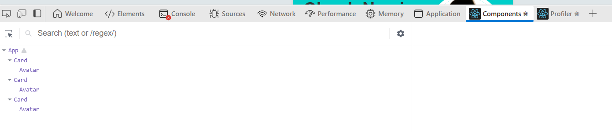

# REACT | Day No. 3 | React Basics | Date: 2025-12-27

tags: import, export, function calling, function referencing

---

## What are you going to learn in this file?

- how to use import and export in React
- difference between named export and default export
- how to use props in React components
- difference between invoking a function and referencing a function
- how to pass props to nested components

---

## Import and Export in React:

why do we use import and export in React?

- In React, we use import and export to manage and organize our code into reusable components and modules.
- Exporting allows us to make functions, objects, or primitives from a file available for use in other files.
- Importing allows us to bring those exported components or modules into other files where they are needed.

### How to Export and Import Components in React:

1.  **Exporting a Component:**

- You can export a component using either named exports or default exports.

- **Named Export:**

```jsx
// MyComponent.jsx
export function MyComponent() {
  return <div>Hello, World!</div>;
}
```

- **Default Export:**

```jsx
// MyComponent.jsx
export default function MyComponent() {
  return <div>Hello, World!</div>;
}
```

### What is the difference between named export and default export?

- Named exports allow you to export _`multiple`_ components or variables from a single file. When importing, you need to use the `exact name` of the exported component or variable within curly braces.
- Default exports allow you to export a `single` component or variable from a file. When importing, `you can choose any name for the imported component` or variable without using curly braces.
- so the main difference is:
  - Named Export: Multiple exports per file, must use exact names when importing.
  - Default Export: Single export per file, can use any name when importing.
    exmaple of using differnt name while importing default export:

```jsx
// Header.jsx
export default function Header() {
  return <div>Hello, World!</div>;
}
// App.jsx
import RenamedHeader from "./Header";
// or
import AnyNameYouWant from "./Header";
// Here, we can use 'RenamedHeader' instead of 'Header'
function App() {
  return (
    <div>
      <RenamedHeader />
      /* or */
      <AnyNameYouWant />
    </div>
  );
}
```

2.  **Importing a Component:**

- You can import components using the `import` statement.
- **Importing a Named Export:**

```jsx
// App.jsx
import { Header } from "./Header";
function App() {
  return (
    <div>
      <Header />
    </div>
  );
}
```

- **Importing a Default Export:**

```jsx
// App.jsx
import Header from "./Header";
function App() {
  return (
    <div>
      <Header />
    </div>
  );
}
```

- You can also combine named and default imports in a single statement:

```jsx
// App.jsx
import Header, { Footer } from "./Layout";
function App() {
  return (
    <div>
      <Header />
      <Footer />
    </div>
  );
}
```

-importing everything from a module:

```jsx
// utils.js
export function add(a, b) {
  return a + b;
}
export function subtract(a, b) {
  return a - b;
}
// App.jsx
import * as Utils from "./utils";
function App() {
  return (
    <div>
      <p>Addition: {Utils.add(5, 3)}</p>
      <p>Subtraction: {Utils.subtract(5, 3)}</p>
    </div>
  );
}
```

if we console.log(Utils), it will show an `object` containing all the exported functions from utils.js.

```jsx
console.log(Utils);
// Output:
{
 add: function add(a, b) { ... },
 subtract: function subtract(a, b) { ... }
}
```

### ! Note !! :

- when importing a function, make sure to include the parentheses `()` to invoke the function.

```jsx
import { myFunction } from "./myModule";
myFunction(); // Correct: Invokes the function
myFunction; // Incorrect: Just references the function without invoking it
```

what is the diggernce between invoking a function and referencing a function?

- Invoking a function means calling it to execute its code, which is done by adding parentheses `()`. For example, `myFunction()` will run the code inside `myFunction`.
- Referencing a function means simply mentioning the function by its name without executing it. For example, `myFunction` refers to the function itself, allowing you to pass it around or assign it to variables without running its code.
- Why do we yuse referencing a function?
- Referencing a function is useful when you want to pass the function as an argument to another function, assign it to a variable, or use it as a callback without immediately executing it.

example:

```jsx
function greet() {
  console.log("Hello!");
}
function executeFunction(func) {
  func(); // Invokes the passed function
}
executeFunction(greet); // Passing the reference of 'greet' function
// Output: "Hello!"

// asigning function to a variable
const sayHello = greet; // Referencing the 'greet' function
sayHello(); // Invokes the function

// using as a callback
setTimeout(greet, 1000); // References 'greet' to be called after 1 second
```

so in simple words:

- when you want to run a function, you invoke it with `()`.
- when you want to use the function itself without running it, you reference it by its name

---

## Props in React:

- Props (short for "properties") are a way to pass data from a parent component to a child component in React.
- Props are read-only, meaning that a child component cannot modify the props it receives from its parent.
- in avery simple way:
- in Html we use attributes to pass data to elements, similarly in React we use props to pass data to components.

example of props and html attributes:

```jsx
// Html
<h1 class="title" id="main-title">Welcome to React</h1>
// class and id are attributes in HTML, their names cant be changed  itself.
// in react we use similar way, but we specify them first and then pass values to them
// React
<Component name="John" lastName="Smith" />
// Here, 'name' and 'lastName' are props in React, their names can be changed as per our requirement.

// Component definition in Component.jsx
function Component(props) {
    const {name, lastName} = props; // destructuring props
  return <h1>Hello, {name} {lastName}!</h1>;
}

export default Component;
```

- ! Note !! :

  - {} are the way to embed props values in JSX.

  - Yes, curly braces `{}` are essential in JSX when you want to embed JavaScript expressions, including props values, within your JSX code. They allow you to dynamically insert values into your components.

#### Steps to use props in React:

1. put props in the component definition as a parameter. `Card(props)`
2. use props inside the component using `props.propName` or destructuring `const {title, description} = props;`
3. put those props in the html structure that the component returns. we have to use curly braces `{}` to embed props values in JSX.
   `<h1>{title}</h1> <p>{description}</p>`
4. export the component. `export default Card;`

5. while using the component, pass values to props using attributes syntax <br>
   `<Card title="My Title" description="This is a description." />`

---

- what if there is a component that is inside another component structure , and we want to pass props to the inner component?
  - In such cases, you need to understand that when we use the component as a tag like `<Component name="value" />`, the attributes of this component can be used in other components only if we pass them down as props.
  - So, if you have a parent component that contains a child component, and you want to pass props to the child component, you need to pass those props from the parent component to the child component explicitly.
  - Example:

```jsx
// Card.jsx
function Card(props) {
  return (
    <div className="card">
      <h2>{props.name}</h2>
      <p>This is a card component.</p>
      <Avatar img={props.img} /> //
    </div>
  );
}

// Avatar.jsx
function Avatar(props) {
  return ;
}

// App.jsx
<Card name="John Doe" img="avatar.jpg" />;
```

Explanation for the example above:

- In the `App.jsx`, we use the `Card` component and pass `name` and `img` as props.
- Inside the `Card` component, we receive the `name` prop and display it.
- We also pass the `img` prop down to the `Avatar` component.
- The `Avatar` component receives the `img` prop and uses it to display the image.

in simple words:

- The attributes of a component are like HTML tags attributes, and to use them in nested components, you need to pass them down as props explicitly.

---

## React Dev Tools Extension:

- React Dev Tools is a browser extension that allows you to inspect and debug React applications more effectively.
- It provides a set of tools to help developers understand the component hierarchy, state, and props of their React applications.
- Why to use it?
  - It helps in visualizing the component tree, making it easier to understand the structure of the application.
  - You can inspect the props and state of each component, which is useful for debugging and understanding how data flows through the application.
  - It allows you to modify the state and props of components in real-time, enabling you to see how changes affect the UI without having to refresh the page.
    

!! TIP !! :

- Whenever you see yourself creating the same thing again and again with the same class and same structure, it's a good indication that you should create a reusable component for it.
- This helps in maintaining a cleaner and more efficient codebase.

---
