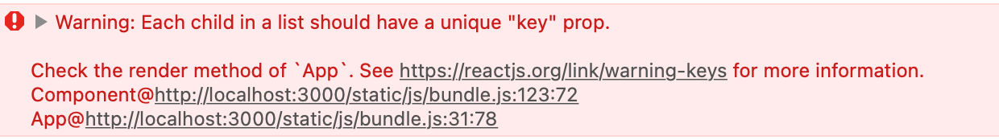

# REACT | Day No. 4 | React Basics | Date: 2025-12-29/28

tags: import, export, map(), filter(), reduce(), find(), findIndex, dd, dt, dl,
arrow functions, substring.

What are you going to learn in this file?

- how to map data to components in React using map() method.
- dd, dt, dl tags in HTML and when to use them.
- map(), filter(), reduce(), find(), findIndex methods in JavaScript with examples.
- substring() method in JavaScript with example.
- different ways to write arrow functions in JavaScript.

---

## Mapping Data to Components in React:

- why to use it?
  - When we have a list of data (array or object) that we want to display in our React app, we can use `map()` method to iterate over the data and create a new array of React components for each item in the list.
  - so instead of manually creating components for each item, we can use `map()` to dynamically generate them based on the data we have.

### Example of Mapping Data to Components:

```jsx
import React from "react";
const fruits = ["Apple", "Banana", "Cherry", "Date"];
function FruitList() {
  return (
    <ul>
      {fruits.map((fruit, index) => (
        <li key={index}>{fruit}</li>
      ))}
    </ul>
  );
}
export default FruitList;
```

- In this example, we have an array of fruits. We use the `map()` method to iterate over each fruit in the array and create a `<li>` element for each fruit. The `key` prop is used to give each list item a unique identifier, which helps React optimize rendering.

- index in the map function is the position of the current element in the array. It starts from 0 for the first element, 1 for the second, and so on.
- so index is part of the parameters that the map function provides to its callback function.
  `array.map((element, index, array) => { ... })`
  `- element`: The current element being processed in the array.
  `- index`: The index of the current element being processed in the array.
  `- array`: The array that `map` was called upon.

#### ! Note ! :

`key` Prop in React Lists:

- Always provide a unique `key` prop when rendering lists in React. Without it you will get a warning in the console.
- The `key` helps React identify which items have changed, are added, or are removed, improving performance during re-renders.



- `key` is not accessible inside the component as a prop. It is used internally by React. so it is not passed to the component like other props.

---

## dd,dt,dl Tags in HTML:

- `dl` (Description List) is used to create a list of terms and their descriptions.
- `dt` (Description Term) is used to define a term/name in a description list.
- `dd` (Description Definition) is used to describe the term/name in a description list.

- Why to use it?

  - It provides a semantic way to represent pairs of terms and their definitions or descriptions.
  - It helps improve accessibility and SEO by providing clear structure to the content.

  - when to use it?
    - Use `dl`, `dt`, and `dd` when you have a list of terms and their corresponding descriptions, such as glossaries, FAQs, or any other content that involves definitions.

---

## map(), filter(), and reduce(), find(), findIndex Methods in JavaScript:

`map():`

- The `map()` method creates a new array populated with the results of calling a provided function on every element in the calling array.

```javascript
const numbers = [1, 2, 3, 4];
const doubled = numbers.map((num) => num * 2);
console.log(doubled); // Output: [2, 4, 6,8]
```

there ways on how to pass the callback function to the map method:

```javascript
// 1. Using an anonymous function
const numbers = [1, 2, 3, 4];
const doubled = numbers.map(function (num) {
  return num * 2;
});
console.log(doubled); // Output: [2, 4, 6, 8]
// 2. Using an arrow function
const numbers = [1, 2, 3, 4];
const doubled = numbers.map((num) => num * 2);
console.log(doubled); // Output: [2, 4, 6, 8]
// 3. Using a named function
function double(num) {
  return num * 2;
}
const numbers = [1, 2, 3, 4];
const doubled = numbers.map(double);
console.log(doubled); // Output: [2, 4, 6, 8]
```

`filter():`

- The `filter()` method creates a new array with all elements that pass the test implemented by the provided function. so we put a condition inside the callback function. and if the condition is true, the element is included in the new array.

```javascript
const numbers = [1, 2, 3, 4, 5, 6];
const evenNumbers = numbers.filter((num) => num % 2 === 0);
console.log(evenNumbers); // Output: [2, 4, 6]
```

`reduce():`

- The `reduce()` method executes a reducer function (that you provide) on each element of the array, resulting in a single output value.
- The reducer function takes four arguments: accumulator, currentValue, currentIndex, and array. The most commonly used are accumulator and currentValue.
- think of it as a way to "reduce" an array to a single value by accumulating results.
- Think of it as a way to accumulate values from an array into a single result.
- its logic is to take two values at a time from the array, apply some operation, and carry the result forward to the next iteration until the entire array has been processed.
- so it will take the first two elements of the array, apply the operation, then take the result and the next element, apply the operation again, and so on until all elements are processed.

```javascript
const numbers = [1, 2, 3, 4];
const sum = numbers.reduce(
  (accumulator, currentValue) => accumulator + currentValue,
  0
);
console.log(sum); // Output: 10
```

- in simple and short: -`accumulator`: is the accumulated value that is carried over from one iteration to the next. and its initial value is provided as the second argument to the `reduce()` method (in this case, `0`), and it could be any value (number, string, object, etc.) depending on the operation being performed, and it doesnt need to be an element from the array.
  - `currentValue` is the current element being processed from the array.

\_ what operations can we do inside the reduce method?

- We can perform various operations inside the `reduce()` method, such as summing numbers, multiplying values, concatenating strings, or even building complex data structures like objects or arrays.

Examples:

```javascript
// Summing numbers
const numbers = [1, 2, 3, 4];
const sum = numbers.reduce((acc, curr) => acc + curr, 0);
console.log(sum); // Output: 10
```

```javascript
// Multiplying numbers
const numbers = [1, 2, 3, 4];
const product = numbers.reduce((acc, curr) => acc * curr, 1);
console.log(product); // Output: 24
```

```javascript
// Concatenating strings
const words = ["Hello", " ", "World", "!"];
const sentence = words.reduce((acc, curr) => acc + curr, "");
console.log(sentence); // Output: "Hello World!"
```

```javascript
// Building an object
const people = [
  { name: "Alice", age: 25 },
  { name: "Bob", age: 30 },
  { name: "Charlie", age: 35 },
];
const ageMap = people.reduce((acc, person) => {
  acc[person.name] = person.age;
  return acc;
}, {});
console.log(ageMap); // Output: { Alice: 25, Bob: 30, Charlie: 35 }
```

`find():`

- The `find()` method returns the value of the _`first`_ element in the array that satisfies the provided testing function. If no elements satisfy the testing function, it returns `undefined`.
- difference between find and filter methods:
  - `find()` returns the first matching element, while `filter()` returns all matching elements in a new array.
    so the difference is that `find()` returns a single element (the first match) or `undefined`, whereas `filter()` returns an array of all matching elements.
    or `find()` single item, while `filter()` returns multiple items (an array).

```javascript
const numbers = [1, 2, 3, 4, 5];
const found = numbers.find((num) => num > 3);
console.log(found); // Output: 4
```

`findIndex():`

- The `findIndex()` method returns the index of the _`first`_ element in the array that satisfies the provided testing function. If no elements satisfy the testing function, it returns `-1`.

```javascript
const numbers = [1, 2, 3, 4, 5];
const foundIndex = numbers.findIndex((num) => num > 3);
console.log(foundIndex); // Output: 3
```

`substring()` Method in JavaScript:

- The `substring()` method returns a subset of a string between one index and another, or through the end of the string.

```javascript
const str = "Hello, World!";
const result = str.substring(0, 5);
console.log(result); // Output: "Hello"
```

- In this example, `substring(0, 5)` extracts the characters from index `0` to index `5` (not including index `5`), resulting in the string "Hello".

---

## Arrow Functions Recap: (or Fat Arrow Functions)

different ways to write arrow functions in JavaScript:

```javascript
// 1. Single parameter, single expression (implicit return)
const square = (x) => x * x;
console.log(square(4)); // Output: 16
```

```javascript
// 2. Multiple parameters, single expression (implicit return)
const add = (a, b) => a + b;
console.log(add(3, 5)); // Output: 8
```

```javascript
// 3. Multiple parameters, multiple statements (explicit return)
const multiply = (a, b) => {
  const result = a * b;
  return result;
};
console.log(multiply(3, 5)); // Output: 15
```

```javascript
// 4. No parameters, single expression (implicit return)
const getCurrentTime = () => new Date().toLocaleTimeString();
console.log(getCurrentTime()); // Output: Current time as a string
```

```javascript
// 5. No parameters, multiple statements (explicit return)
const greet = () => {
  const greeting = "Hello, World!";
  return greeting;
};
console.log(greet()); // Output: "Hello, World!"
```
