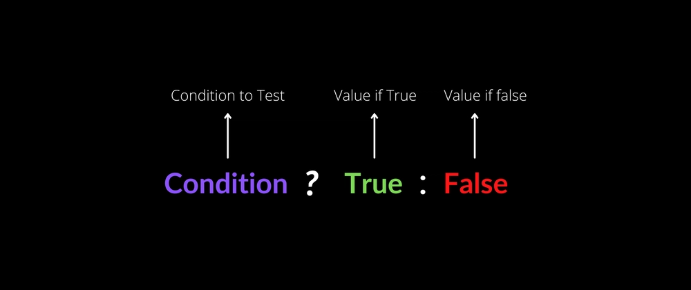
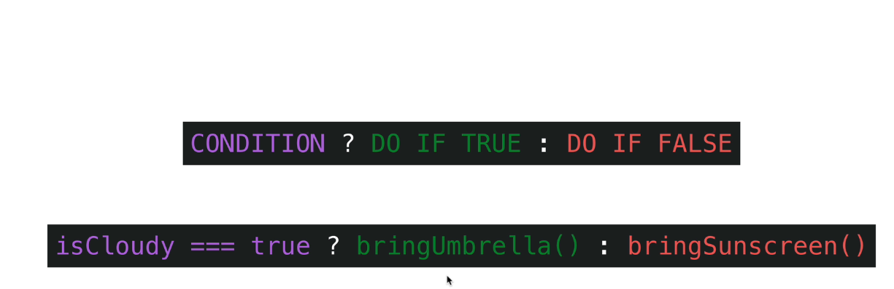

# REACT | Day No. 4 | React Basics | Date: 2025-12-30

tags:

what are you going to learn in this file?

---

# React conditional rendering with the ternary operator & And Operator:

## Single-responsibility principle:

- The single-responsibility principle is a programming concept that states that a component or function should have only one reason to change. In other words, each component or function should be responsible for a single task or functionality.

- in simple words, a component should do one thing and do it well.

- This principle helps to keep code organized, maintainable, and easier to understand. When a component has a single responsibility, it becomes easier to test, debug, and modify without affecting other parts of the code.
- In React, following the single-responsibility principle means creating `small, focused components that handle specific tasks or functionalities`. This makes it easier to manage and reuse components throughout the application.

#### Example in words:

- Let's say we have a React application that displays a list of users. This application has two main tasks: 1.fetching user data from an API and 2.displaying the user list.
- In case we create a single component that handles both tasks. what happens if we need to change the way we fetch user data? We would have to modify the entire component, which could lead to unintended side effects on the user list display.
- For that reason, we can create two separate components: `UserFetcher` and `UserList`. The `UserFetcher` component is responsible for fetching user data from the API, while the `UserList` component is responsible for displaying the list of users.
- By separating these responsibilities, we can easily modify the `UserFetcher` component without affecting the `UserList` component. This makes our code more modular, easier to maintain, and less prone to bugs.

## so, in summary, the single-responsibility principle encourages us to create components that focus on a single task or functionality, making our code more organized and maintainable.

## Conditional (ternary) operator:

It is a JavaScript operator that takes three operands: a condition, a value if the condition is true, and a value if the condition is false. It is often used as a shorthand for an `if-else` statement.

### Syntax:

                      condition ? valueIfTrue : valueIfFalse





### Example:

```jsx
import React from "react";
const Greeting = ({ isLoggedIn }) => {
  return (
    <div>{isLoggedIn ? <h1>Welcome back!</h1> : <h1>Please sign up.</h1>}</div>
  );
};
export default Greeting;
```

### Variations of the ternary operator:

1. Nested ternary operator:
   Explanation: In this example, we have a `Greeting` component that takes a prop called `isLoggedIn`. If `isLoggedIn` is true, it displays "Welcome back!", otherwise, it displays "Please sign up." This is a simple use of the ternary operator to conditionally render different content based on the value of `isLoggedIn`.

```jsx
import React from "react";
const Greeting = ({ isLoggedIn, isAdmin }) => {
  return (
    <div>
      {isLoggedIn ? (
        isAdmin ? (
          <h1>Welcome Admin!</h1>
        ) : (
          <h1>Welcome back!</h1>
        )
      ) : (
        <h1>Please sign up.</h1>
      )}
    </div>
  );
};
export default Greeting;
```

2. Short-circuit evaluation with the AND operator (`&&`):
   Explanation: In this example, we have a `Notification` component that takes a prop called `hasNotifications`. If `hasNotifications` is true, it displays "You have new notifications." If `hasNotifications` is false, nothing is rendered. This is a common pattern in React to conditionally render content based on a boolean value using the AND operator.

```jsx
import React from "react";
const Notification = ({ hasNotifications }) => {
  return <div>{hasNotifications && <h1>You have new notifications.</h1>}</div>;
};
export default Notification;
```

### ! Note ! :

- when we have && operator, what it is name?

  - it is called short-circuit evaluation.

- When we have the short-circuit evaluation with the AND operator (`&&`), if the condition on the left side of the operator is true, the expression on the right side is evaluated and returned. If the condition on the left side is false, the entire expression evaluates to false, and nothing is rendered.
- This is useful in React for conditionally rendering components or elements based on a boolean value.

So:

                   ( value1 && value2)

- If value1 is false, return false, then Javascript will not evaluate value2. and it will stop there.
- If value1 is true, return value2.

- how is that useful in React?
- this useful in order to make ternary operator shorter when we have only one condition to check for true value.

as an example:
a very simple example for starter with && operator:

```jsx
import React from "react";
const WelcomeButton = ({ isLoggedIn }) => {
  return <div>{isLoggedIn && <button>Logout</button>}</div>;
};
export default WelcomeButton;
```

- In this example, if `isLoggedIn` is true, the "Logout" button will be rendered. If `isLoggedIn` is false, nothing will be rendered.
- notice that React will render the second part when testing the first part is true.

---

## States in React:

The equation of state in React is:

                      UI = f(State)

This means that the User Interface (UI) is a function of the state. In other words, the UI is determined by the current state of the application.

Lets use water and ice and their relation to temperature as an analogy to understand this concept better:
UI = f(temperature)

- When the temperature is above 0 degrees Celsius, water is in its liquid state. In this state, the UI of a water bottle would show liquid water.
  `UI = f(20) `
- When the temperature drops below 0 degrees Celsius, water freezes and turns into ice. In this state, the UI of a water bottle would show solid ice.
  `UI = f(0) `
- so, the temperature (state) determines whether the water is in a liquid or solid state, which in turn affects how the water bottle is represented in the UI.

- Similarly, in React, the state of a component determines how it is rendered in the UI. When the state changes, React re-renders the component to reflect the new state\_

---

## Declarative vs Imperative programming:

`Declarative programming` is like telling someone what you want to achieve without specifying how to do it. For example, if you want to bake a cake, you would say "I want a chocolate cake" (declarative) without explaining the step-by-step process of baking it.<br>
and in programming, declarative code focuses on the desired outcome rather than the specific steps to achieve it. For example,in React, you can declare what the UI should look like based on the state, and React takes care of updating the UI when the state changes.

`Imperative programming`, on the other hand, is like giving someone a detailed recipe for baking a cake. You would explain each step of the process, such as mixing ingredients, preheating the oven, and baking the cake for a specific amount of time.<br>
and in programming, imperative code focuses on the specific steps to achieve a desired outcome. For example, in traditional JavaScript, you would write code that directly manipulates the DOM to update the UI based on changes in data.

##### Example:

```jsx
// Declarative approach in React
const Greeting = ({ isLoggedIn }) => {
  return (
    <div>{isLoggedIn ? <h1>Welcome back!</h1> : <h1>Please sign up.</h1>}</div>
  );
};
// Imperative approach in traditional JavaScript
function updateGreeting(isLoggedIn) {
  const greetingElement = document.getElementById("greeting");
  if (isLoggedIn) {
    greetingElement.innerHTML = "<h1>Welcome back!</h1>";
  } else {
    greetingElement.innerHTML = "<h1>Please sign up.</h1>";
  }
}
```

- In the declarative approach, we simply declare what the UI should look like based on the `isLoggedIn` state, and React takes care of updating the UI accordingly.
- In the imperative approach, we have to write code that directly manipulates the DOM to update the greeting based on the `isLoggedIn` state.

- so , imperative is like telling the computer exactly how to do something step by step, while declarative is a very high-level or shorter way of telling the computer what you want to achieve without using too much code.

---

## Data Destructuring:

It is a way to extract values from arrays or properties from objects and assign them to variables in a more concise and readable way.

### Example of Array Destructuring:

```javascript
const numbers = [1, 2, 3];
const [a, b, c] = numbers;
console.log(a); // 1
console.log(b); // 2
console.log(c); // 3
```

### Example of Object Destructuring:

```javascript
const person = { name: "John", age: 30 };
const { name, age } = person;
console.log(name); // John
console.log(age); // 30
```

```JavaScript
 const person = {name : 'John', age :30};
 const {personName, PersonAge} = person
 // personName will be undefined, why? because the variable names must match the property names in the object.

 // to solve it we have two options:
 // 1. use the same variable names as the property names:
 const {name, age} = person
// 2. or we can use different variable names by using a colon to specify the new variable name:
    const {name: personName, age: PersonAge} = person
```

---

## React Hooks:

- React Hooks are special functions that allow you to use state and other React features in functional components.

useState Hook:
The `useState` hook is a built-in React hook that allows you to add state to functional components. It returns an array with two elements: the current state value and a function to update that state.</br>

useState itself returns an array with two elements:

1.  The current state value. `state`
2.  A function that allows you to update the state value. `setState`

                       const [state, setState] = useState(initialValue);

    and that is why we use array destructuring to extract the two elements from the array returned by useState.

! Note ! :

```JavaScript
return (
    <div className="container">
      <h1>{number}</h1>
      <button onClick={setNumber(number + 1)}>+</button>
    </div>
  );
```

the above code is incorrect because we are calling the setNumber function immediately when the component renders, instead of passing a function reference to the onClick event handler. <br>

React will execute the setNumber function right away, which will update the state and cause the component to re-render. This can lead to unexpected behavior and performance issues.

to call a function in similar way, we can do differnt ways:

```JavaScript,
// 1. using an arrow function:
  <button onClick={() => setNumber(number + 1)}>+</button>
// 2. using a regular function (anonymous function):
  <button onClick={function() { setNumber(number + 1); }}>+</button>
// 3. using bind method:
  <button onClick={setNumber.bind(this, number + 1)}>+</button>
   4. defining a separate function and passing its reference:
  const incrementNumber = () => {
    setNumber(number + 1);
  };
    <button onClick={incrementNumber}>+</button> // passing the function reference not calling it using ()

```
