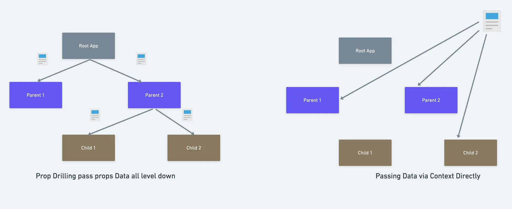

# React

in simple terms, React is a JavaScript library for building user interfaces. It allows developers to create reusable UI components that can manage their own state, making it easier to build complex and interactive web applications.

## <strong> **Note**: </strong>

## React is a single page application (SPA) framework/library. wich means that the entire web application runs on a single web page, and there is no need to reload the page or navigate to a differnet page to access differnet parts of the application. instead React uses client-side (the browser) routing to dynamically update the content of the page.

### **_Things we need to know to start with React_**:

- There are a few React frameworks and libraries to build a React application like:
  - Next.js
  - Gatsby
  - Remix
  - React Native (for mobile apps)
  - React Router (v7)
  -
- vite and Parcel

---

### **ReactDOM**:

it is a package that can update the DOM, it works by using a virtual DOM to update only the parts of the DOM that have changed, instead of re-rendering the entire DOM every time there is a change in the state of a component.

## Commands to create a React Application

````javascript
//1.
npx create-react-app <app-name>
//? creates new React app with all libraries and dependencies and also testing libraries.
//? it also takes along time to be installed.


   //2.
npm create vite@latest
//! creates new React app with Vite as a bundler

//3.
cd <app-name>
//? navigate to the app directory

### the steps to start a React Application

```javascript
//1. create a React Application
npx create-react-app my-app
//2. navigate to the app directory
cd my-app
//3. start the React Application
npm start
// we can also install other react libraries or bundlers like Vite or Parcel
//4. to install Vite
npm create vite@latest
//5. to install Parcel
npm install -g parcel-bundler
why to install Vite or Parcel?
// Vite and Parcel are alternative bundlers to Create React App's default bundler (Webpack). They offer faster build times and improved development experiences, especially for larger projects.
````

## Note **!** :

first step in order to understand an application is to read package.json file to know about the dependencies and scripts used in the application.

- what does package.json file provide? what are the most important fields in package.json file?
  - the most important are:
    - name
    - version
    - scripts <<-- important to know what commands are available to run the application : (npm start, npm test, npm build) or(npm run <script-name> like |npm run start | npm run build | npm run test)
      - what each script does?
      - "start": "react-scripts start", // starts the development server >> so it is only used during development
      - "build": "react-scripts build", // builds the app for production >>creates the final version of the app that can be deployed
      - "test": "react-scripts test", // runs the test suite >> used to run tests to ensure the app is working as expected
      - "eject": "react-scripts eject" // ejects the app from Create React App configuration (not reversible) >> used when you want to customize the configuration of the app beyond what Create React App provides by default
- - dependencies <<-- important to know what libraries are being used in the application
  - devDependencies

# React Flow and Structure:

````


# CODE_SNAPPS
```javascript
npx create-react-app my-app
// npx create-react-app app-name>


````

# How to use **Props** to pass data to components:

_! Note !_ : props are objects, so they are {key: value} pairs.

in the folloiwing example, the key is _"title"_ and the value is _"My Card Title"_.

```javascript
// file : App.jsx
const Cards = (props) => {
  console.log("Props are", props);
  return <Cards title="My Card Title" />;
};
```

```javascript
// file Cards.jsx
const Cards = (props) => {
  return <h1>{props.title}</h1>;
};
```

## use props values, we have 2 options:

1. using props.key_name like : props.title
2. using destructuring to pull the key_name from props object like: const { title }

```javascript
// method 1: using props.key_name
const Cards = (props) => {
  return <h1>{props.title}</h1>;
};
```

```javascript


//method 2: using destructuring
const Cards = (props) => {
 1. const { username = "Default user name" } = props; // destructuring with default value
  2. const { username } = props; // destructuring
  // You can choose either 1 or 2 based on your needs, but 1 is safer as it provides a default value.
  return (
    <h1>{username}</h1>
  );
};

// methode 3: destructuring in the function parameter
const Cards = ({ title }) => {
  return (
    <h1>{title}</h1>
  );
};

// for multiple props
const Cards = (props) => {
  const { title ="Default title", subtitle ="Default subtitle"} = props; //! this is the important line to know
  return (
    <div>
      <h1>{title}</h1>
      <h2>{subtitle}</h2>
    </div>
  )};
```

## In this topic of using props, there is one more important thing to know:

- adding objects as props to components:

```javascript
// file : App.jsx
const user = {
  name: "John Doe",
  age: 30,
  email: "address@example.com",
};

const Cards = (props) => {
  console.log("Props are", props);
  return <Cards user={user} />;
};
```

## onClick Event in React:

! **note** !:

```javascript
onClick ={functionName}  // without parentheses, so we cant pass a function that needs arguments directly, we need to wrap it in an anonymous function.
onClick ={() => functionName(args)} // with parentheses
```

### title for the follwoing is:

there are 2 way to use function with onClick event in React:

```JavaScript

const [color, setColor] = useState("olive");
//1 making a separate function
  function changeColor(color) {
    setColor(color);
  }
 //! in onclick event:
 <button onClick={()=>changeColor("blue")}>Blue</button>

 //2. is to directly call the function in the onClick event:
 <button onClick={()=>setColor("red")}>Red</button>


```

```javascript


# Shortcuts in React:

- rfce : react functional component export
- rafce : react _arrow_ functional component export

```

```


You need to run \***\*npx tailwindcss init\*\*** to generate the config file.

Compare with named export (for clarity)
Named export ❌ (must use same name)
export const categories = [ ... ];

import { categories } from "./categories";

Default export ✅ (you choose the name)
export default [ ... ];

import anythingYouWant from "./categories";
```

# Extra Info:

## Memoization:

what is that?
optimization technique to _speed_ up computer programs by storing the result of function calls and return the cached result when the same input used again. This will avoid the reuse of computing power.
example to make the idea more understandable, >> it is like if you have a calculator and you ask it to calculate 2 + 2, it will give you 4. If you ask it again to calculate 2 + 2, it will immediately give you 4 without recalculating it. This is memoization.

- this idea is based on cache which is a storage location that stores data temporarily for faster access.
- it stores it in memory. the memory can be RAM or disk storage.
- how memoization works?
  - check if the result is already in the cache.
  - if it is, return the cached result.
  - if it is not, compute the result and store it in the cache for future use.
- in React, is an important feature because react based on re-rendering components when state or props change.

## useCallback Hook & useMemo Hook:

- both are used for memoization in React.
- useCallback:
- used to memoize functions.
  - it returns a memoized version of the callback function that only changes if one of the dependencies has changed.
  - useful when passing callbacks to optimized child components that rely on reference equality to prevent unnecessary renders.
  - example:

```javascript
const memoizedCallback = useCallback(() => {
  doSomething(a, b);
}, [a, b]);
```

- useMemo:
- used to memoize values.
  - it returns a memoized value that only changes if one of the dependencies has changed.
  - useful for optimizing expensive calculations that are performed during rendering.
  - example:

```javascript
const memoizedValue = useMemo(() => computeExpensiveValue(a, b), [a, b]);
```

## React Hooks List:

- useState: allows you to add state to functional components. ==> const [<state>, <setState>] =useState(<defaultValue>);
- useEffect: allows you to perform side effects in functional components. + what does that mean? + it means that a function does sth outside itself or affect other like fetching data, updating the DOM directly. + ==> useEffect(<function>, <dependency>)
- useCallback: memoizes functions to prevent unnecessary re-renders. ==> const memoizedCallback = usedCallback( function, dependencies); where dependencies is an **array** of values that the function depends on.
- useMemo: memoizes values to optimize expensive calculations. ==> const memoizedValue = useMemo( function, dependencies); where dependencies is an **array** of values that the function depends on
- useRef:
- - - the difference between useCallback and useMemo:
  - useCallback is used to **memoize functions**, while useMemo is used to **memoize values**.

useCallback and useEffect:
useEffect: if sth in the dependencies changed then run the function, and also at the first render
useCallback: the opposite, as long as those dependencies are constant keep the result of the function.

---

## What is state management in React?

State management in React refers to the way we handle and manage the state of our application. State is an object that holds data that can change over time, and it is used to determine how the UI should look and behave. In React, state is typically managed using the useState hook for local component state, but for larger applications, more advanced state management solutions like _Redux_, _MobX_, or _Context API_ are often used to manage global state across multiple components.

---

# Context API in React:

- It is used to share data across the components without passing the props manually through every level.
- It allows to create global state of data providing global access to all the components.
- it solves the problem of prop drilling, and what is that? prop drilling is the process of passing data from a parent component to a child component through multiple levels of components, which can be tedious and error-prone.
- th most basic way to manage states in react is by using props to pass data from parent to child components. and we use prop drilling to do that.
- the problem with that is when we have a big project with many level of components this becomes a big problem as we have to pass the props through many levels of components just to get to the component we want to use it in.
- Prop drilling happens in the programming phase when you need to pass data through many layers of components just to get to the component you want to use it in.
- this problem is solved by Context API, as it creates global variables to be used throughout the application and no any middle component is involved.

## HOW TO USE CONTEXT API:

1. we need React.createContext() to create a context object. It has two proprties: providor and consumer.

- PROVIDOR: It acts as a parent component that provides the data to its child components. ! this is a wrapper component. which means it wraps around other components to provide them with the context data.
- CONSUMER: It acts as a child component that consumes the data provided by the

### there are 4 steps to use Context API in React:

1. Create a context using React.createContext()
2. Wrap the component tree with the context provider and pass the data to be shared as a
3. value prop.
4. Use the context consumer or useContext hook in the child components to access the shared data

5. Create a context:

```javascript
import React from "react";
const MyContext = React.createContext();
```

2. Provide the context:

```javascript
import React from "react";
import MyContext from "./MyContext";

const UserContextProvider = ({ children }) => {
  const [user, setUser] = useState(null);

  return (
    <userContext.Provider value={{ user, setUser }}>
            {children}   {" "}
    </userContext.Provider>
  );
};
export default UserContextProvider;
```

what this code does?

- it creates the Magic Box and its job to hold data in a central place so that any comonent inside the app can reach in and grab it without pop drilling.

explain the code for me, it is first time i learn it

### there could be multiple context providers in a React application.

## Commands of Context API:

- React.createContext()

# Notes:

- the reaction in react happens on two things:
  1. state change
  2. props change



### Provider explantin:

- in React variable are trapped inside components where they are defined. so if we have a variabl in a parent component, child components cannt access it directly unless we pass it as props.
- so what we need is a way to share variables across components without passing them as props.

## What is Outlet in React Router Dom?

- it is a component provided by React Router Dom library.
- it is used to render child routes in a parent route component.
- it acts as a placeholder for the child routes to be rendered.
- it is useful when we have nested routes in our application.
- it allows us to create a layout component that can be shared across multiple routes.
- it helps to keep the code clean and organized by separating the layout from the content of the routes.
